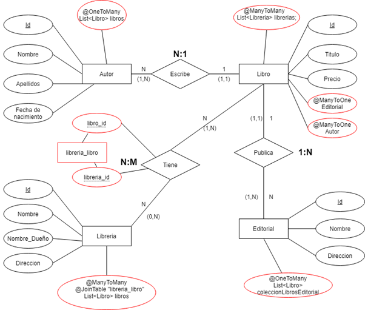
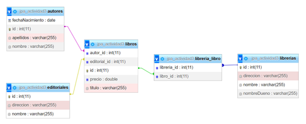
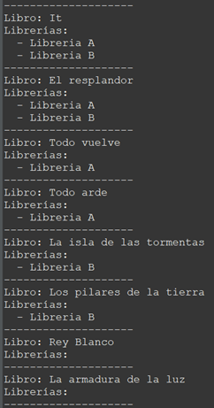

# Acceso a Datos

## Actividad 3 –  JPA y JAXB

Actividad Realizada por:

- Alberto Arroyo Santofimia.

Pautas de elaboración

## Requerimiento 1. Actividad3_Alberto_V2

La idea de esta aplicación será la de generar un modelo de datos para gestionar una cadena de librerías.

Se pide diseñar el programa mediante JPA que cumpla con, al menos, los siguientes requisitos y entidades.

Autor, tendrá un id, un nombre, unos apellidos y una fecha de nacimiento. Un autor podrá escribir muchos libros
Editorial, tendrá un id, un nombre y una dirección. También tendrá una colección de libros publicados por la editorial.
Libro, tendrá un id, un título, un precio, una editorial y un autor.
Librería, tendrá un id, un nombre, un nombre del dueño, una dirección y una colección de libros. Además, hay que tener en cuenta que un libro puede estar en diferentes librerías.
Todas estas entidades tendrán relaciones bidireccionales.

Una vez diseñado el modelo de datos y creadas las tablas se pide hacer las siguientes operaciones (los valores serán elegidos por el alumno, pero deberán de tener sentido).

Dar de alta 3 autores
Dar de alta 2 editoriales
Dar de alta 8 libros, cada libro será escrito por uno de los autores dados de alta previamente y pertenecerá a uno de los editoriales dados de alta previamente.
2 librerías, cada librería tendrá 4 libros dados de alta previamente
Además, se pide realizar las siguientes consultas y mostrarlas por pantalla, cada una debe de ser independiente:

Mostrar todos los libros dados de alta, con su editorial y su autor
Mostrar todos los autores dados de alta, con sus libros asociados
Mostrar todas las librerías, con solamente sus libros asociados
Mostrar todos los libros dados de alta, y en la librería en la que están.

