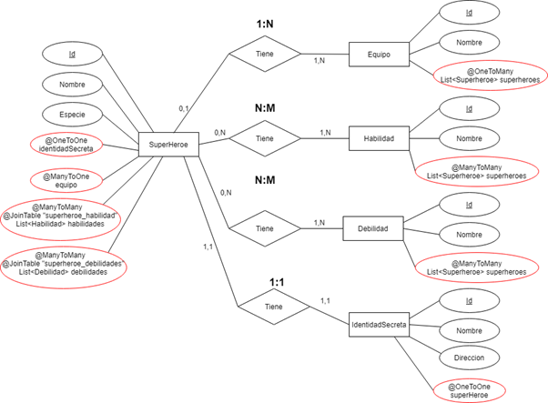

# Acceso a Datos

## Actividad 3 –  JPA y JAXB

Actividad Realizada por:

- Alberto Arroyo Santofimia.

Pautas de elaboración

## Requerimiento 2. Actividad3_Alberto_R2_JusticeLeagueFinal

Se pide realizar un nuevo modelo de datos que cubra todos los tipos de relaciones visto en clase, esto es, 1 a 1, 1 a N y N a M. El modelo tendrá las entidades necesarias para realizar dichas relaciones y será inventado por los alumnos, es decir, será un trabajo original. Se piden hacer las entidades y las anotaciones en cada entidad para realizar el modelo de datos de JPA.

Se recomienda que cada integrante del equipo realice un modelo nuevo para practicar y entender JPA.

Por ejemplo, se podría hacer un modelo de datos de una empresa de coches, que tuviera una lista de empleados asociados y una dirección asociada.

### Voy a recrear la base de datos que tiene Batman con su plan de contingencia contra la Liga de la Justicia en caso de que se vuelva peligrosa, recopilando toda la información sobre cada héroe.

Superheroe tiene una relación de uno a uno con IdentidadSecreta. 1:1
Equipo tiene una relación de uno a muchos con Superheroe. 1:N
Superheroe tiene una relación de muchos a muchos con Habilidad. N:M
Superheroe tiene una relación de muchos a muchos con Debilidad. N:M
IdentidadSecreta tiene una relación de uno a uno con Superheroe. 1:1
Habilidad tiene una relación de muchos a muchos con Superheroe. N:M
Debilidad tiene una relación de muchos a muchos con Superheroe. N:M

