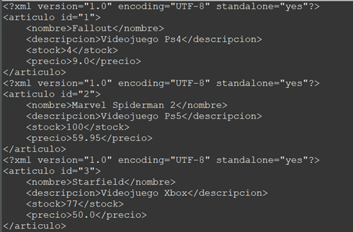

# Acceso a Datos

## Actividad 3 –  JPA y JAXB

Actividad Realizada por:

- Alberto Arroyo Santofimia.

Pautas de elaboración

## Requerimiento 3. Actividad3_Alberto_R3

Aplicando JAXB, coger la clase ‘Articulo’ de la actividad 1 y serializar una lista con 3 artículos a XML. Para ello se deberán de usar las anotaciones de JAXB correspondientes.

